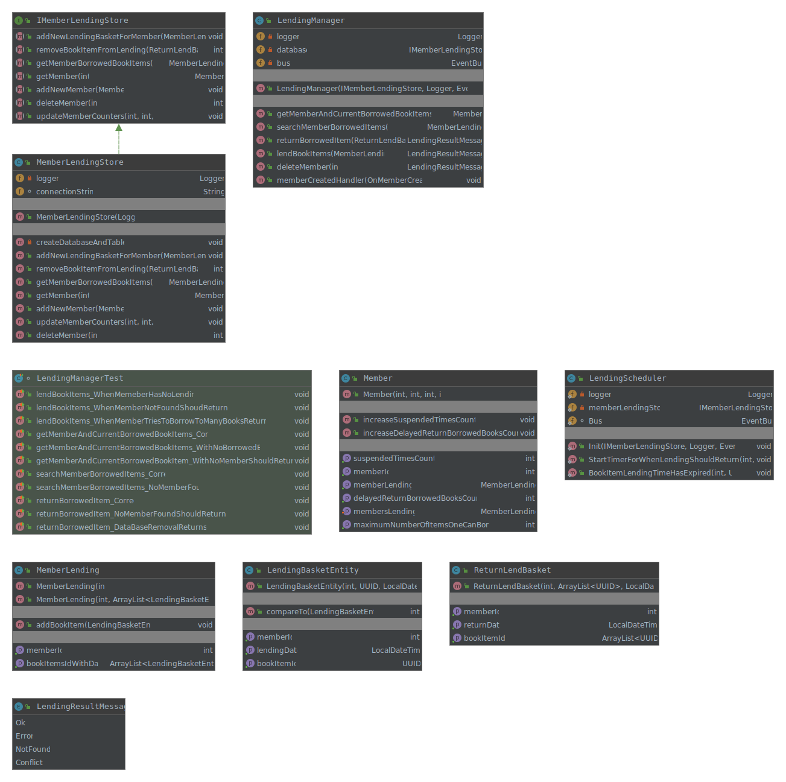

# 1IK173-Library-Lending-Management
### Introduktion
Projektet består av en konsollapplikation och tre separata oberoende moduler. (Se Modules sektionen).
Man använder JDK 14. Om man har något annat får man ändra det i Intellij under File, klicka på Project Structure och under Project Settings klicka på Project. Efter det så visas (till höger) Project SKD dropdown där man ändrar.

Man använder log4j för loggning, junit5 för unittester med mockito för mocking av klasser.
Loggning sker till en fil och ska finnas under "modulen"/logs (Exempel: BookManagement/logs).

För att spara data använder man den enkla fildatabasen Sqlite som förstår enkla SQL syntax så att man lättare kan söka och filtrera med SQL.
Sqlite kommer att spara databasen som en fil tex bookmanagememtDB.db.
Varje modul har egen databas för enklare administration. Kommunikation mellan moduler sker med hjälp av events (händelser) med greenrobot eventbus.

## Viktiga Use Case (användningsfall) 
Första försöket att förstå vilka use cases det kan finnas.
Man bör också rita scenarion.
1. Låna en eller fler bok "items".
1. Lämna en eller fler bok "items".
1. Registrera ny medlem.
1. Ta bort medlem på egen begäran.
1. Ta bort medlem (reglera) på grund av bibliotekets regelbrott.

### Förklaring av Use Cases
#### Register Member (Skapa ny användare)
1. Man skapar ny användare med id, namn osv., med en specifik roll och den sparas i databasen.
1. När den har sparats skickas meddelandet OnMemberCreated som innehåller (memberId och maxantalBöcker man kan låna) till modulen (MembershipLending).
1. När MembershipLending får meddelandet sparar den en ny post i databasen med attribut för att man senare, när man lånar böcker, kan kolla om man får låna och hur många böcker man får låna.
    * memberId
    * maxAntalBöckerManFårLåna  
    * antaletGångerDelayedReturn
    * antaletGångerSuspend

## Use Case Diagram

## Moduler
Förslag till moduler i systemet. 
1. MembershipAdministration hanterar allt kring användare, roller, status på medlem (låst, borttagen ur register) och login...
1. BookManagement hanterar allt kring böcker, titlar, fysiska böcker, antal tillgängliga...
1. MembershipLending hanterar medlemmarnas utlåningar, håller reda på när böcker ska lämnas tillbaka, hur många böcker man inte har lämnat tillbaka per medlem, håller reda på när och om man blir reglerad.

## Class Diagrams
### BookManagement modul
Man bör beskriva vad olika metoder gör...

### MembershipAdministration modul
Man bör beskriva vad olika metoder gör...

### MembershipLending modul
Man bör beskriva vad olika metoder gör...

