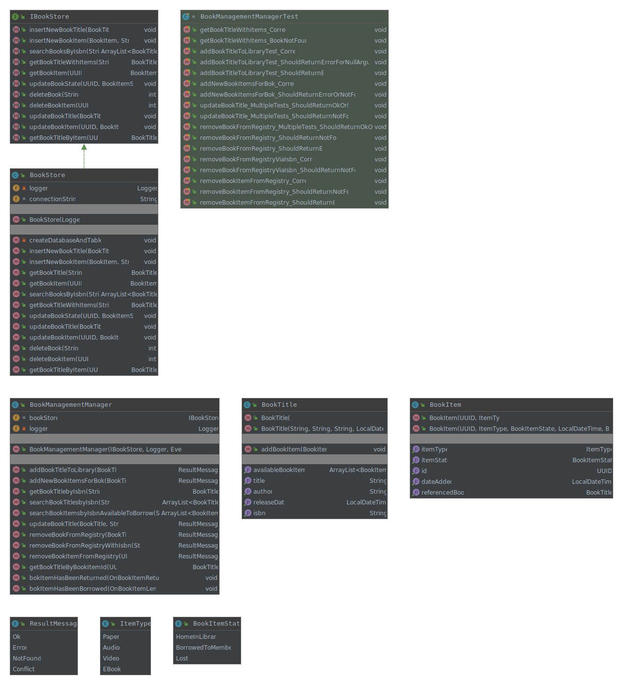
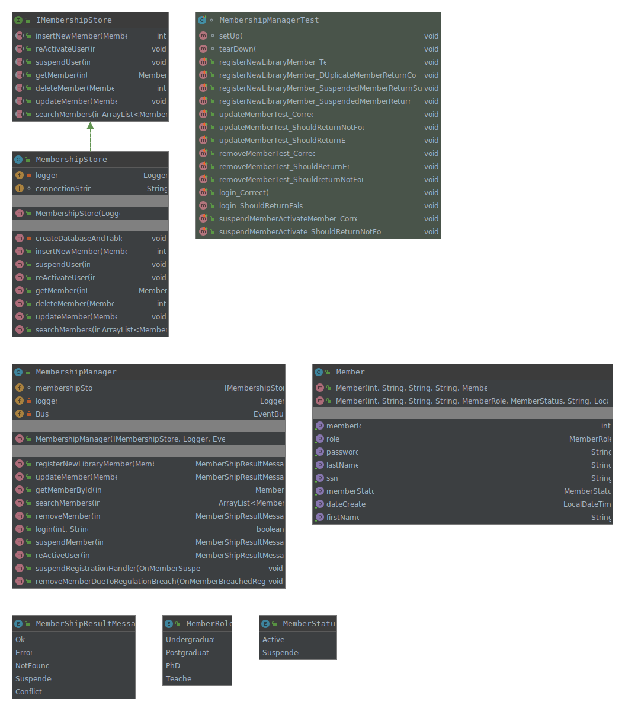

# 1IK173-Library-Lending-Management
### Introduktion
Projektet består av en consol applikation och tre separata oberoende moduler. (See Modules sektion).
Man använder openJDK 14. Om man har annat får man ändra det i Intellij under File, klicka på Project Structure och under Project Settings klicka på Project. Efter det visas till höger Project SKD dropdown där man ändrar.

Man använder log4j för loggning, junit5 för unittester med mockito för mocking av klasser.
Loggning sker till en fil och ska finnas under "modulen"/logs (Exempel: BookManagement/logs).

För att spara data använder man enkla fildatabasen Sqlite som förstår enkla SQL syntax så att man kan lättare söka och filtrera med SQL.
Sqlite kommer spara databasen som fil tex bookmanagememtDB.db.
Varje modul har egen databas för enklare administration.

## Viktiga Use Case (användningsfall) 
Första försöket att förstå vilka use cases kan det finns.
Man bör också rita scenarion.
1. Låna en eller fler bok "items".
1. Lämna en eller fler bok "items".
1. Registrera ny medlem.
1. Ta bort medlem på egen begäran.
1. Ta bort medlem (reglera) på grund av bibliotekets regelbrott.

### Förklaring av Use Cases
#### Register Member (Skapa ny användare)
Man skapar ny användare med id, namn osv., med en specifik roll och den sparas i databasen.
När den har sparats skickas meddelande OnMemberCreated som innehåller (memberId och maxantalBöcker man an låna) till modulen (MembershipLending).
När MembershipLending får meddelandet sparar den ny post i databasen med attribut för att senare när man lånar böcker man kan kolla om man får låna och hur mycker böcker man får låna.
1. memberId
1. maxAntalBöckerManFårLåna  
1. antaletGångerDelayedReturn
1. antaletGångerSuspend

## Use Case Diagram

## Modules
Förslag till moduler i systemet. 
1. MembershipAdministration hanterar allt kring användare, roler, status på medlem (låst, borttagen ur register) och login...
1. BookManagement hanterar allt kring böcker, titlar, fysiska böcker, antal tillgängliga...
1. MembershipLending hanterar medlemarnas utlåningar, håller reda på när böcker ska lämnas, hur många böcker man inte har lämnat per medlem, håller reda på när/om man blir reglerad.

## Class Diagrams
### MembershipAdministration module
Man bör beskriva vad olika metoder gör...

### BookManagement module
Man bör beskriva vad olika metoder gör...

### MembershipLending module
Man bör beskriva vad olika metoder gör...

