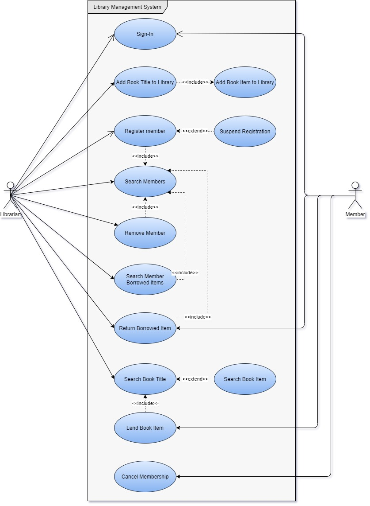

# 1IK173-Library-Lending-Management
## Viktiga Use Case (användningsfall) 
Första försök att förstå vilka use cases det finns.
Man bör också rita scenario
1. Låna en eller fler bok "items".
1. Lämna en eller fler bok "items".
1. Registrera ny medlem.
1. Ta bort medlem på egen begäran.
1. Ta bort medlem (reglera) på grund av "breach".

## Use Case Diagram

## Modules
Förslag till moduler i systemet. 
1. MembershipAdministration hanterar allt kring användare, roler, status (låst, borttagen) och login...
1. BookManagement hanterar allt kring böcker, titlar, fysiska böcker, antal tillgängliga...
1. MembershipLending hanterar medlemarnas utlåningar, håller reda på när böcker ska lämnas, hur många böcker man inte lämna, om man blir reglerad.

